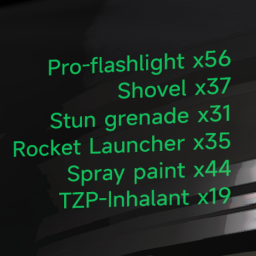

# ShipGrabbableStat

A mod for Lethal Company which reliably displays the total count of specific grabbables on the ship.

Currently, whenever you scan the scrap on your ship you have to position yourself just right to get
all loot on the screen at once. Even then, your scanner never picks up more than 16 things at once,
which makes it hard to tell how many specific grabbables you actually have.

This mod introduces a small new counter on top right screen. It is displayed whenever you scan
from inside the ship and will always show the total grabbables counts.

## Installation

- Install [BepInEx](https://thunderstore.io/c/lethal-company/p/BepInEx/BepInExPack/)
- Unzip this mod into your `Lethal Company/BepInEx` folder

Or use the thunderstore mod manager to handle the installing for you.
